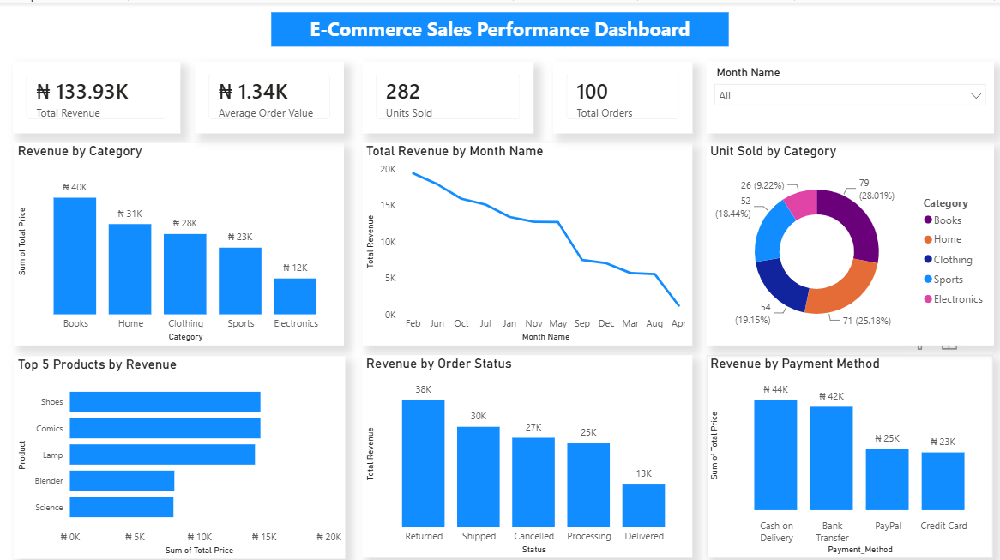

# E-Commerce Sales Performance Analysis

## From messy transactional data to business insights

## Project Overview

What started as a messy e-commerce sales dataset became an opportunity to practice the complete data analysis process: from data cleaning and transformation to analysis, visualization, and business recommendations.

The dataset, sourced from Kaggle, contained **103 records and 11 columns** with several data quality issues, including inconsistent category values, missing data, invalid entries, negative values, and unreliable total calculations.

I cleaned and transformed the dataset using **Power Query**, performed the analysis using **Power BI and DAX**, and built an interactive sales performance dashboard to answer key business questions.

The goal was not just to create charts, but to understand what the data was saying and translate those findings into recommendations that could potentially support better business decisions.

## Business Problem

An e-commerce business needs to understand how its sales are performing and where its revenue is coming from.
The analysis therefore focuses on answering questions such as:

 ▪︎ How much revenue is being generated?
 ▪︎ How many orders and units are being sold?
 ▪︎ Which categories and products contribute most to revenue?
 ▪︎ Which months show stronger sales performance?
 ▪︎ Which payment methods generate the most revenue?
 ▪︎ What does the order status distribution reveal?
 ▪︎ Where are there opportunities that may require further investigation?

### The 4-question framework
I approached the project using four questions:

1. **What is the problem?**
2. **What metrics matter?**
3. **What recommendation would I make?**
4. **What potential business impact could it drive?**

This helped me move beyond simply describing the dataset and focus on the business meaning behind the numbers.

## Key Performance Indicators
After cleaning and transforming the data, the dashboard reports:

KPI - Result 

Total Revenue:  ₦133.93K 
Average Order Value: ₦1.34K 
Units Sold: 282 
Total Orders: 100 

These KPIs provide a high-level view of the sales performance captured in the dataset.

## Data Cleaning & Transformation
Before analyzing the data, I used **Power Query in Power BI** to identify and resolve data quality issues.

The cleaning process followed:

**Inspect > Identify > Validate > Correct > Recalculate > Verify**

One principle guided the process:

**Don't guess your data into being clean.**

Where a value could be confidently corrected, I corrected it. Where the intended value could not be determined reliably, I retained it as null rather than introducing an unsupported assumption.

### Key data quality issues identified

▪︎ Inconsistent category names and capitalization
▪︎ Incorrect product-category assignments
▪︎ Missing values
▪︎ Invalid quantity entries
▪︎ Negative quantities
▪︎ Invalid price entries
▪︎ Negative price values
▪︎ Missing or inconsistent total values
▪︎ Invalid dates

### Category standardization
The original Category field contained inconsistencies such as:

▪︎ Sports vs sports
▪︎ Electronics vs electronic, electronics, ELECTRONICS, Electronicss

There were also instances where products appeared under categories that did not logically match them.
I reviewed the product-category relationships and standardized the products into five categories:

Category | Products 

▪︎ Books | Science, Biography, Comics, Fiction 
▪︎ Clothing | Shoes, T-shirt, Jacket, Jean 
▪︎ Electronics | Smartphone, Laptop, Headphones, Smartwatch 
▪︎ Home | Blender, Vacuum, Lamp, Microwave 
▪︎ Sports | Tennis Racket, Basketball, Football, Yoga Mat 

### Quantity cleaning
The Quantity field contained missing values, negative values, and invalid text entries.

For example, '4a' could not be reliably interpreted as a valid quantity, so it was treated as missing rather than guessed.

After cleaning:

▪︎ **92% valid**
▪︎ **8% null/empty**
▪︎ **0% errors**

### Price cleaning
The Price field contained invalid values such as:

▪︎ 'abd'
▪︎ 'four hundred'
▪︎ '-100'

Where the intended value was clear, it was corrected. For example:

'four hundred' = '400'

Values that could not be reliably interpreted were converted to null.

After cleaning:

▪︎ **92% valid**
▪︎ **8% null/empty**
▪︎ **0% errors**

### Total calculation
The original Total field contained missing and inconsistent values.

I created a corrected total using:

**Total = Quantity × Price**

Where either Quantity or Price was unavailable, the calculated Total remained null rather than inventing a value.

The corrected values were cross-checked against the available original values.

After cleaning:

▪︎ **85% valid**
▪︎ **15% null/empty**
▪︎ **0% errors**

### Date cleaning
The Order Date field contained an invalid value ('abc'), which was converted to null.

Valid dates were standardized, and additional time-related fields were created for analysis, including:

▪︎ Month
▪︎ Month Name
▪︎ Year

## Analysis
The cleaned dataset was analyzed in Power BI to understand sales performance across several dimensions.

### Revenue by Category
The category analysis showed:

Category | Revenue

Books: ₦40K 

Home: ₦31K 

Clothing: ₦28K 

Sports: ₦23K 

Electronics: ₦12K 

**Books generated the highest revenue**, while Electronics recorded the lowest category revenue in the dataset.
Revenue was not interpreted in isolation; units sold and other dimensions were also considered to avoid making conclusions based solely on sales value.

### Top 5 Products by Revenue
The dashboard highlights the five products contributing the most revenue:

1. Shoes
2. Comics
3. Lamp
4. Blender
5. Science

This provides a focused view of high-performing products without overcrowding the dashboard with every product.

### Monthly Revenue
Monthly revenue was analyzed to identify periods of relatively stronger and weaker sales performance.

The analysis can help identify patterns worth investigating further, particularly around:

▪︎ Product demand
▪︎ Order volume
▪︎ Product mix
▪︎ Pricing
▪︎ Promotional activity

The observed monthly patterns should be treated as descriptive findings from this dataset rather than forecasts of future sales.

### Revenue by Order Status
Revenue was also examined across order statuses:

Status | Revenue 
Returned | ₦38K 
Shipped | ₦30K 
Cancelled | ₦27K 
Processing | ₦25K 
Delivered | ₦13K 

One notable observation is the relatively high revenue associated with **Returned and Cancelled** orders.

This does not mean that all of this revenue was ultimately realized by the business. Returned and cancelled transactions may involve refunds or reversals and therefore warrant further investigation.

### Revenue by Payment Method
Payment method performance showed approximately:

Payment Method | Revenue
Cash on Delivery | ₦44K 
Bank Transfer | ₦42K 
PayPal | ₦25K 
Credit Card | ₦23K 

Cash on Delivery generated the highest revenue among the payment methods represented in the dataset, followed by Bank Transfer.

## Recommendations

Because this project uses a **Kaggle dataset rather than data provided by an actual client**, these recommendations are my few recommendations based on the patterns observed in the available

### 1. Investigate the drivers of strong category performance
Books generated the highest category revenue at approximately ₦40K.

Rather than automatically increasing investment in the category, I would investigate the products, units sold, order volume, and pricing responsible for this performance.

**Potential business impact:**  
This could support more informed inventory and promotional decisions.

### 2. Investigate the lower performance of Electronics
Electronics generated approximately ₦12K, the lowest category revenue.

Further analysis should examine product level performance, pricing, units sold, order volume, and order outcomes before determining whether the category requires intervention.

**Potential business impact:**  
This could reveal specific underperforming products or opportunities for targeted improvement.

### 3. Investigate returned and cancelled orders
Returned and cancelled orders represent a significant portion of the revenue values shown in the dataset.

I would recommend investigating these transactions by product, category, and payment method to identify recurring patterns.

**Potential business impact:**  
Identifying avoidable returns and cancellations could potentially improve realized revenue and operational efficiency.

### 4. Use stronger-performing periods to inform planning
The monthly analysis identifies periods with relatively stronger revenue performance.

The business could investigate what products, categories, and order volumes contributed to these periods and use those findings to inform future inventory and promotional planning.

**Potential business impact:**  
Better planning around periods of stronger demand could improve resource allocation and product availability.

### 5. Explore opportunities to increase Average Order Value
The average order value in the dataset is approximately ₦1.34K.
Potential strategies such as product bundling, cross-selling, and related-product recommendations could be explored.

**Potential business impact:**  
An increase in average order value could provide an opportunity to grow revenue without relying entirely on increasing the number of orders.

## Dashboard
The final Power BI dashboard provides a one page view of e-commerce sales performance.

The dashboard includes:

▪︎ Total Revenue
▪︎ Average Order Value
▪︎ Units Sold
▪︎ Total Orders
▪︎ Revenue by Category
▪︎ Monthly Revenue
▪︎ Units Sold by Category
▪︎ Top 5 Products by Revenue
▪︎ Revenue by Order Status
▪︎ Revenue by Payment Method
▪︎ Month filter usung sloier

## Tools Used

**Kagggle**: Dataset source 
**Power Query**: Data cleaning and transformation
**Power BI**: Data visualization and dashboard development
**DAX**: Analytical measures and calculations

## Project Workflow

Raw Dataset
     |
Data Quality Assessment
     |
Data Cleaning & Transformation
     |
Data Validation
     |
DAX Measures
     |
Exploratory Analysis
     |
Dashboard Development
     |
Insights
     |
Recommendations
     |
Potential Business Impact.
